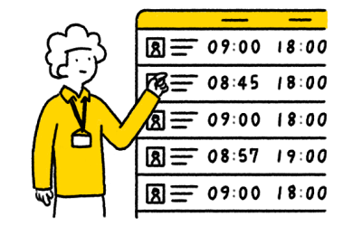
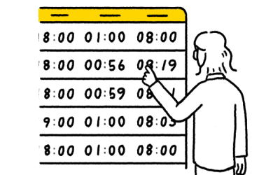

    <h2 class="num">
      
        step
        01
      
      勤務開始〜終了
    </h2>
  

打刻の操作で勤務を開始します。新たなワークも容易に作成し割り当て。勤務終了の打刻でタイムシートが作成されます。

    

      
ワーカー

      

      
勤務開始の打刻を行う

    

    

      
スタッフ

      

      
ワークを新規作成

    

    

      
ワーカー

      

      
オープンワークを引き受け業務指示を読む

    

    

      
ワーカー

      

      
勤務終了の打刻を行う

    

  

    <h3>このステップで活用できる主な機能</h3>





  

    <h2 class="num">
      
        step
        02
      
      締め作業
    </h2>
  

タイムシートと日報を自動生成。確認された証憑は人事会計システムに同期されます。

    

      
スタッフ

      

      
ワーカーの勤務時間を確認

    

    

      
ワーカー

      

      
タイムシートを確認し、 必要があれば修正

    

  

    <h3>このステップで活用できる主な機能</h3>




  

  <h2 class="num">
    
      step
      03
    
    組織の改善
  </h2>

チームビルディングと業務標準化を行います

    

      
スタッフ

      

      
人材育成のためにラダーを設計する

    

    

      
スタッフ

      

      
評価やサンクスカードを送る

    

    

      
スタッフ

      

      
テンプレートを整備する

    

  

    <h3>このステップで活用できる主な機能</h3>



  

