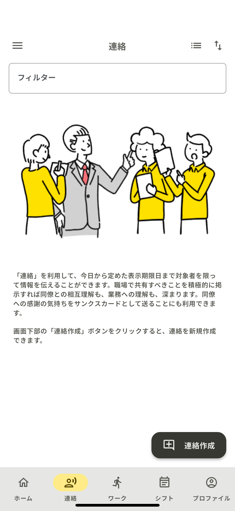
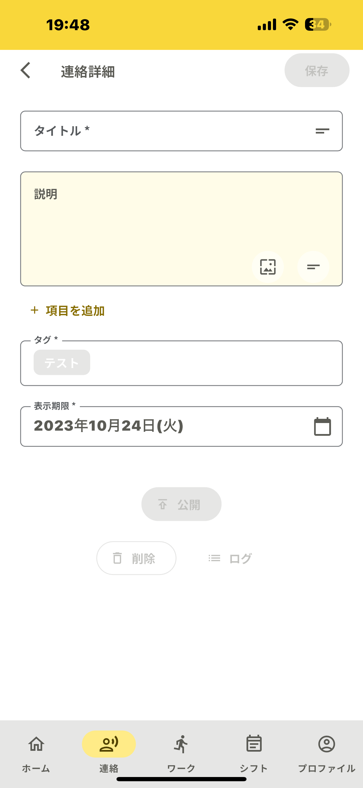

<link href="markdoum.css" rel="stylesheet"></link>

## 1,連絡作成
連絡作成はまず、画面右下の「連絡作成」をタップし、詳細画面に進みます！ 
 

まず、画面右下の「連絡作成」をタップしてください。
次に、詳細画面に移動します。ここで、必要な情報やメッセージを入力しましょう。 
 

### Step1,タイトル
タイトルの内容について詳細を記載します。 
目的を明確にし、連絡の目的を明確に伝えましょう。 
 

### Step2,説明
タイトルの内容について詳細を記載します。 
特にプロジェクトやタスクに関する連絡の場合、期日や優先度、特別な要件に注意を向けることが重要になります。 
 

### Step3,タグ
初期で設定されているタグが表示されています。 
他にも管理者が作成したタグを必要であれば複数追加できます。 
 

### Step4,表示期間
連絡の表示期間を設定します。 
タスクによって表示期間を変更できるので、期間の指定がわかりやすくなります。 
 

全て入力後に「公開」をタップします。 
公開後はチャット機能が使用できるので、不明な点などはすぐに連絡が可能になります！ 
 

以上で連絡作成までの説明になります。 
次回も作成方法や機能についての記事にまとめていきます。

